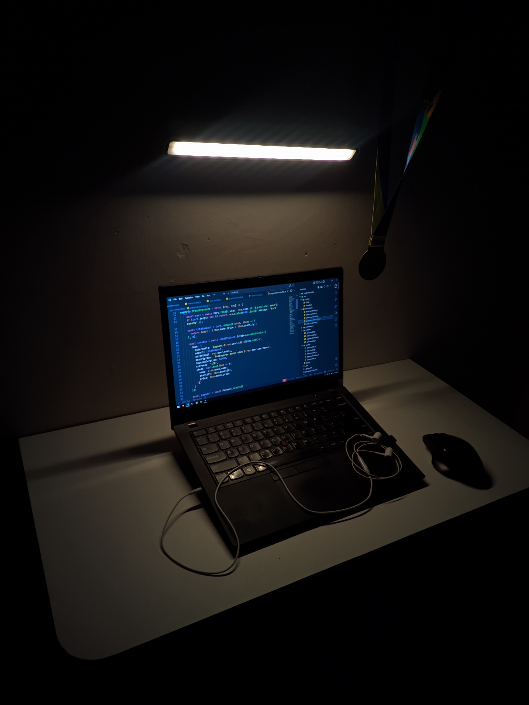
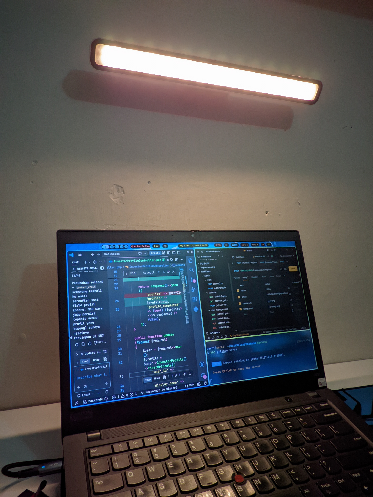

this is my current workspace setup at home where i spend most of my time every day. i usually use this setup for coding projects, learning new tech stuff, playing games after a long day, and sometimes i watching anime or movies at night.

i like keeping the space simple, clean, and comfortable because it helps me stay focused while coding and also makes everything feel more relaxing when chilling. honestly, this setup has become my favorite spot in the house since almost all of my daily activities happen here.

> Right now, one of the things on my wishlist is getting a **new monitor** to improve my productivity and make the overall setup even more comfortable for work and entertainment.

## gallery

